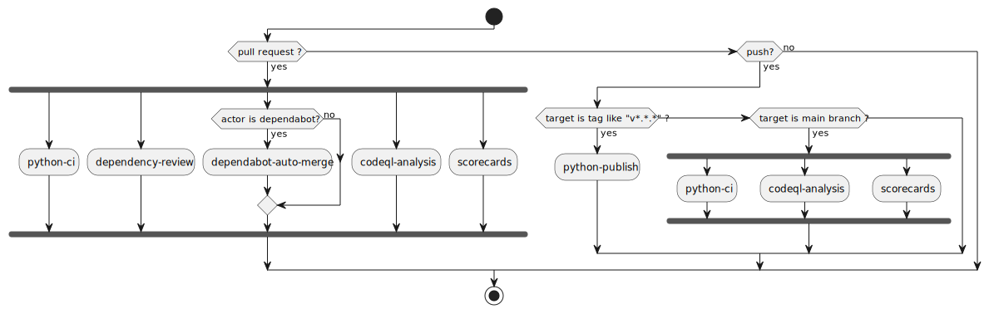
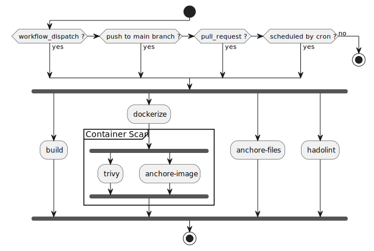
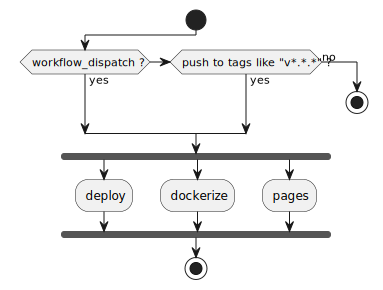

# boilerplate-python

Python プロジェクト用のボイラープレート

[](https://github.com/kannkyo/boilerplate-python/actions/workflows/python-ci.yml)
[](https://github.com/kannkyo/boilerplate-python/actions/workflows/python-publish.yml)
[](https://github.com/kannkyo/boilerplate-python/actions/workflows/codeql-analysis.yml)
[](https://bestpractices.coreinfrastructure.org/projects/6051)

## パイプライン

### 全体像

* すべての Workflow に対して dispatch を定義する。
* pull request, push をトリガーとする workflow を定義する。




### python-ci : CI



### python-publish : CD



## sigstore の構成

```bash
git config --local commit.gpgsign true
git config --local gpg.x509.program gitsign
git config --local gpg.format x509
```

## temp

```bash
in-toto-mock --name vcs-1 -- git clone <repo>
in-toto-mock --name building-1 -- poetry build
in-toto-mock --name qa-1 -- poetry run flake8 . --count --select=E9,F63,F7,F82 --show-source --statistics
in-toto-mock --name qa-2 -- poetry run flake8 . --count --exit-zero --max-complexity=10 --max-line-length=127 --statistics
in-toto-mock --name test-1 -- poetry run pytest --junitxml=junit/test-results.xml --cov=src --cov-report=xml --cov-report=html
tar czf in_toto_link_files.tar.gz vcs-1.link building-1.link qa-1.link qa-2.link test-1.link 
```

```bash
poetry run in-toto-keygen kannkyo
poetry run in-toto-sign --key kannkyo --file kannkyo boilerplate-python.layout

poetry run in-toto-run --key kannkyo --materials . --products . --step-name vcs-1 -- git clone https://github.com/kannkyo/boilerplate-python
poetry run in-toto-run --key kannkyo --materials . --products . --step-name building-1 -- poetry build
poetry run in-toto-run --key kannkyo --materials . --products . --step-name qa-1 -- poetry run flake8 . --count --select=E9,F63,F7,F82 --show-source --statistics
poetry run in-toto-run --key kannkyo --materials . --products . --step-name qa-2 -- poetry run flake8 . --count --exit-zero --max-complexity=10 --max-line-length=127 --statistics
poetry run in-toto-run --key kannkyo --materials . --products . --step-name test-1 -- poetry run pytest --junitxml=junit/test-results.xml --cov=src --cov-report=xml --cov-report=html
```

## git sign

* https://docs.github.com/en/authentication/managing-commit-signature-verification/generating-a-new-gpg-key
* https://dev.to/devmount/signed-git-commits-in-vs-code-36do
* https://qiita.com/shotakaha/items/65a708f96edbe948eb79

GPG キー作成方法。
ここで、ユーザ名とメールアドレスはコミット時のものと一致し、Gitホスティングサービスに登録したものとも一致していなければならない。
また、GitHubの場合はメールアドレスの検証は不要だが、GitLabの場合は必要である。

```bash
# generate gpg key
gpg --full-generate-key

# check <GPG key ID>
gpg --list-secret-keys --keyid-format=long

# view GPG key
gpg --armor --export <GPG key ID>

# tell key to git
git config --global user.signingkey <GPG key ID>
```

